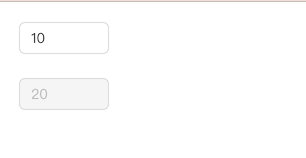

# `[P11]` InputNumber 数字输入框组件

## 项目简介

### 项目介绍

本项目继续实践基础 JavaScript，还是封装 UI 组件，这一次是封装 InputNumber 数字输入框组件。

这是我们第一次练习封装表单组件，就挑了一个比较简单的表单组件。

表单组件非常多，也很值得封装，不过只需要练习封装其中一两个表单组件就足够了，其他的都是类似的。

### 组件说明

- 支持设置默认值
- 支持禁用状态
- 支持设置输入数值的范围
- 支持键盘控制数值的增减，以及可以设置每一次增减的数值
- 支持 `onChange` 回调

### 设计稿说明

- 页面中有两个输入框：
  - 第一个输入框是可以操作的，初始默认值是 10，它能输入的最大值是 20，能输入的最小值是 5。可以通过键盘的上下箭头按钮控制这个输入框的数值，点击上箭头时，输入框数值增加 2，点击下箭头时，输入框数值减少 2。
  - 第二个输入框是不可以操作的，初始默认值是 20。每当第一个输入框的数值发生变化时，第二个输入框的数值会跟着发生变化，保持跟第一个输入框的数值一样。

> [在线体验](https://zhidaofe.github.io/P11-inputnumber-component/s1/index.html)

### 项目要求

- 先按照设计稿和组件说明，实现组件代码。然后在页面中使用你实现的组件来达到题目要求
- 保证最终实现的页面完全复现设计稿，真实的工作中，火眼金睛的设计师 1 px 的差异都能找到，不要心存侥幸
- **先按照设计稿和组件说明真得去开发，不要看参考答案！**，也不要去看业界和开源的组件库代码
- 如果开发过程中碰到问题，不知道怎么实现的话，去网上查找答案，不要去看答案！在真实的工作中，你不会有参考答案的，你只能自己想办法找到问题的解决方案
- 记录你的疑问，比如：
  - 有个很难实现的地方，总感觉自己实现的方案不是最优方案，还有更好的方案
  - 不知道自己的实现方案到底好不好
  - 完成开发之后，再整体 review 一遍自己的代码，觉得还有哪些地方是不够好的
- 带着你的疑问，再去查看参考答案或者开源组件库去寻找答案，如果还是没有得到解答，请来 [**之道前端**](https://kcnrozgf41zs.feishu.cn/wiki/PBj0w5rjUiEWVgktZE0caKOunNc) 提问

### 核心练习知识点

本项目主要核心是练习原生 JavaScript & DOM & 表单，同时练习如何编写一个通用组件。

本项目适合重复练习和琢磨，不断优化你的组件代码，不断思考：**好组件应该是怎样的？**

### 练习本项目你会收获什么？

- 提升原生 JavaScript 的编码熟练度
- 学会正确使用原生 JavaScript 操作 Dom
- 学会正确使用原生 JavaScript 处理 键盘 事件
- 学会正确使用原生 JavaScript 处理 表单 元素
- 学会如何封装一个组件
- 【进阶】深刻理解什么是好的组件
- 【进阶】积累封装组件的经验
- 【进阶】逐渐形成自己的 JavaScript 代码风格

> 如果只实践一次，那就只会有基础收获
>
> 只有不断练习、思考、优化，才会有进阶收获

### 本项目适合的同学

- 处于 L2 水平的同学
- 对原生 JavaScript 还不熟练的同学
- 没怎么封装过 UI 组件的同学
- 没怎么写过 C 端页面，大部分时间在做 admin 系统的同学
- 只会开发 React/Vue 组件，想要练习如何封装原生 JavaScript 组件的同学

## 更多项目

如果你练完本项目之后，

有所收获，却觉得不过瘾，还想练习更多项目的话，

就点击加入 [**之道前端**](https://kcnrozgf41zs.feishu.cn/wiki/PBj0w5rjUiEWVgktZE0caKOunNc) 吧，海量原创项目和众多学习伙伴在等着你！

> **学前端，来之道 —— 陪伴式自学前端圈子**

